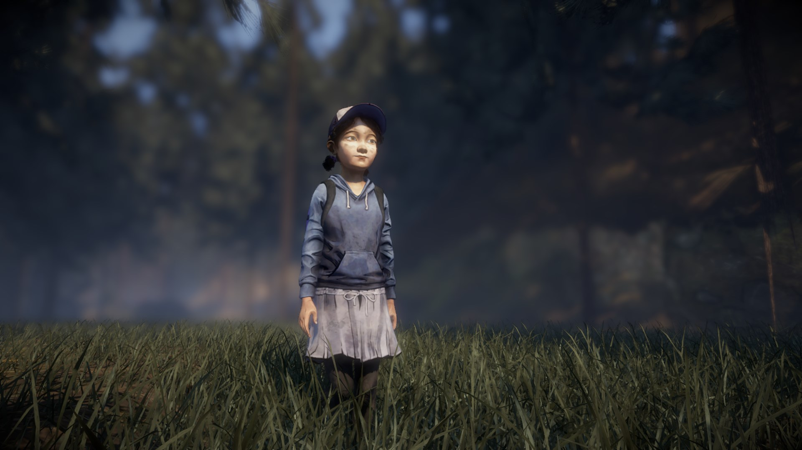

# First Walking Dead Cutscene Mod

### [GITHUB DOWNLOAD](https://github.com/Telltale-Modding-Group/TTDS-FirstCutscene/releases)
### [NEXUS MODS DOWNLOAD](https://www.nexusmods.com/thewalkingdeadthetelltaledefinitiveseries/mods/9)
### [Video Preview](https://youtu.be/973xyVUlZBo?t=20)

## About

This mod is a fully custom cutscene developed and running right inside The Walking Dead Definitive Series game. It's all written in Lua, and has a "sequencer" system with clips and camera angles, and it also plays the games existing animations. This scene conceptually is very simple, and is a proof of concept but this can be used as a base for creating your own cutscenes/gameplay mods for The Walking Dead Telltale Definitive Edition.

I've also included additional functionality, and have a modified menu script that adds a menu item to the definitive edition menu where you can press the button and play the cutscene sequence running in-game.

If there are issues or suggestions with the mod please report them to the [Issues](https://github.com/Telltale-Modding-Group/TTDS-FirstCutscene/issues) tab of this repository OR you can join our discord server and ask for help there.

## DISCLAIMER
**This only works for 'The Walking Dead Telltale Definitive Edition'.**

## Editing/Modifying
***(For Modders/Developers Only)***
**You are free to download the source code and edit/use it as you wish using the [Telltale Script Editor](https://github.com/Telltale-Modding-Group/Telltale-Script-Editor)!** You can even fork this repository to create your own version of this mod. *Just note to be mindful and edit the .tsproj file to change the author to your name and not mine in notepad or another text editor.*

To Edit/Modify this project, be sure to either download this repository or go to the releases tab and download the "Source code.zip" file. Then extract and open the project using the [Telltale Script Editor](https://github.com/Telltale-Modding-Group/Telltale-Script-Editor) and edit the code as you wish!

*NOTE: This project was built using the [Telltale Script Editor Alpha 1.1.0](https://github.com/Telltale-Modding-Group/Telltale-Script-Editor)*
